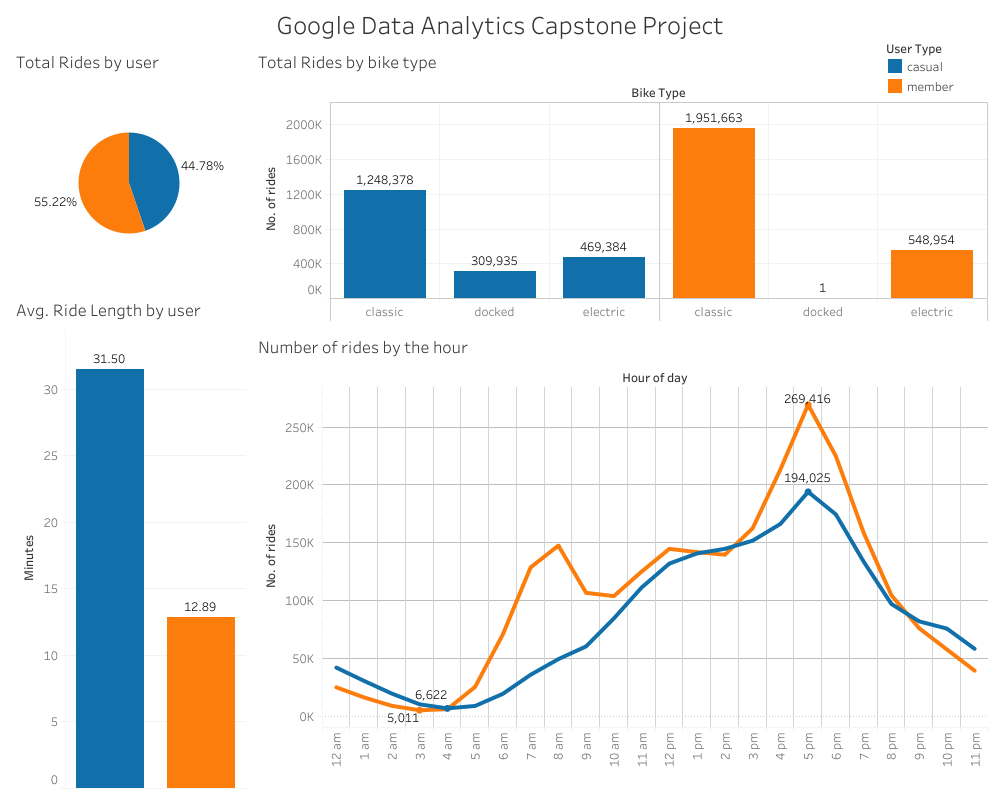
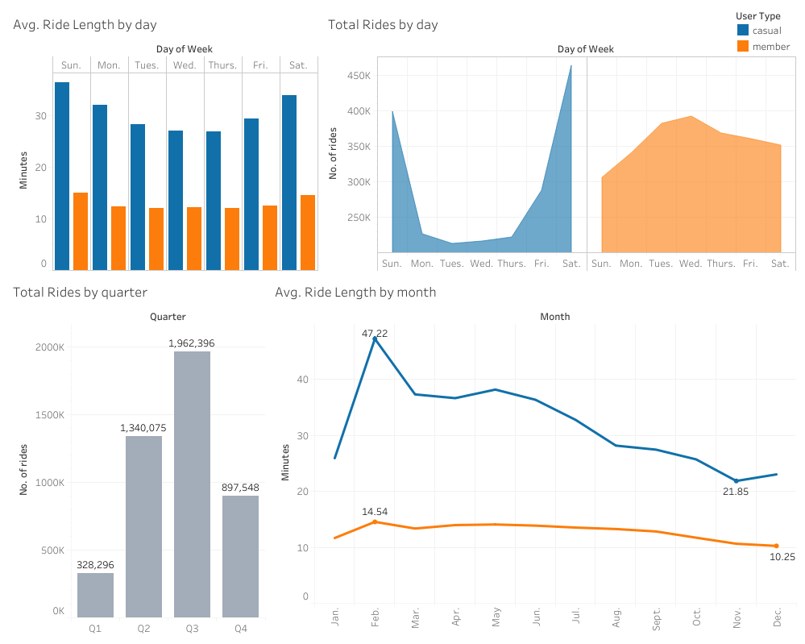

# Scenario

Cyclistic is a bike-share company in Chicago. The director of marketing believes the company’s future success depends on maximizing the number of annual memberships. Your team wants to understand how casual riders and annual members use Cyclistic bikes differently. From these insights, your team will design a new marketing strategy to convert casual riders into annual members. Cyclistic executives must approve your recommendations, so they must be backed up with compelling data insights and professional data visualizations. 

# Key Stakeholders

•	Lily Moreno, Director of Marketing and Manager
•	Cyclistic Executive Team
•	Cyclistic Marketing Analytics Team

# Ask

1.	How do annual members and casual riders use Cyclistic bikes differently? (Task)
2.	Why would casual riders buy Cyclistic annual memberships? 
3.	How can Cyclistic use digital media to influence casual riders to become members? 

# Prepare

Cyclistic’s historical trip data to analyze and identify trends is found using this link (https://divvy-tripdata.s3.amazonaws.com/index.html). This data was made available by Motivate International Inc. under this license (https://www.divvybikes.com/data-license-agreement). This data is public and can be used to explore how different customer types are using Cyclistic bikes. Note that data-privacy issues prohibit  using riders’ personally identifiable information. This means that you are not able to connect pass purchases to credit card numbers to determine if casual riders live in the Cyclistic service area or if they have purchased multiple single passes. This analysis observes data from January 2021 to December 2021.

# Clean Data

- Upload 12 csv files to BigQuery and combine to create a table for the entire year of 2021.
- Add a column for “day_of_week”.  
- Add a column for “ride_length”. 
- Add a column for “ride_month”.
- Remove duplicates
- Remove rows with ride_length less than 1 minute
- Remove rows with station names and id’s that include “Test” or “Base”.  These are considered company test rides.
- Create a table that only includes the following columns (ride_id, ride_length, rideable_type, member_casual, ride_hour_started, weekday, and month)	 

# Transform Data
   
- Combine all 12 tables together as one file named year21.
```sql
CREATE TABLE `bikeshare-338902.cyclistic.year21` AS 
    (SELECT * 
    FROM 
    `bikeshare-338902.cyclistic.Jan21`
    UNION ALL 
    SELECT * 
    FROM 
        `bikeshare-338902.cyclistic.Feb21`
    UNION ALL
    SELECT * 
    FROM 
        `bikeshare-338902.cyclistic.Mar21`
    UNION ALL
    SELECT * 
    FROM 
        `bikeshare-338902.cyclistic.Apr21`
    UNION ALL
    SELECT * 
    FROM 
        `bikeshare-338902.cyclistic.May21`
    UNION ALL
    SELECT * 
    FROM 
        `bikeshare-338902.cyclistic.Jun21`
    UNION ALL
    SELECT * 
    FROM 
        `bikeshare-338902.cyclistic.Jul21`
    UNION ALL
    SELECT * 
    FROM 
        `bikeshare-338902.cyclistic.Aug21`
    UNION ALL
    SELECT * 
    FROM 
        `bikeshare-338902.cyclistic.Sept21`
    UNION ALL
    SELECT * 
    FROM 
        `bikeshare-338902.cyclistic.Oct21`
    UNION ALL
    SELECT * 
    FROM 
        `bikeshare-338902.cyclistic.Nov21`
    UNION ALL
    SELECT * 
    FROM 
        `bikeshare-338902.cyclistic.Dec21`
);
```
- Create a column for day_of_week. ride_length, and ride_month. Save results as new table year21_v2
```sql
SELECT *,
    EXTRACT(DAYOFWEEK FROM started_at) AS day_of_week,
    DATETIME_DIFF(ended_at, started_at, MINUTE) AS ride_length,
    EXTRACT(MONTH FROM started_at) AS ride_month
                   EXTRACT(HOUR FROM started_at) AS ride_hour_started
FROM `bikeshare-338902.cyclistic.year21`;
```
- Create a new table that excludes the following columns: day_of_week and ride_month.  
- Remove rows with ride_length less than 1 minute.
- Remove columns with station names and id’s that include “Test” or “Base”. 
- Save query results as new table “finalyear21”.
```sql
SELECT ride_id, rideable_type, member_casual, ride_length, ride_hour_started,
    CASE
            WHEN day_of_week = 1 THEN "Sunday"
            WHEN day_of_week = 2 THEN "Monday"
            WHEN day_of_week = 3 THEN "Tuesday"
            WHEN day_of_week = 4 THEN "Wednesday"
            WHEN day_of_week = 5 THEN "Thursday"
            WHEN day_of_week = 6 THEN "Friday"
        ELSE "Saturday" END AS weekday,
    CASE
            WHEN ride_month = 1 THEN "January"
            WHEN ride_month = 2 THEN "February"
            WHEN ride_month = 3 THEN "March"
            WHEN ride_month = 4 THEN "April"
            WHEN ride_month = 5 THEN "May"
            WHEN ride_month = 6 THEN "June"
            WHEN ride_month = 7 THEN "July"
            WHEN ride_month = 8 THEN "August"
            WHEN ride_month = 9 THEN "September"
            WHEN ride_month = 10 THEN "October"
            WHEN ride_month = 11 THEN "November"
        ELSE "December" END AS month,
FROM `bikeshare-338902.cyclistic.year21_v2`
WHERE ride_length > 0
    AND start_station_name NOT LIKE "%BASE%"
    AND start_station_id NOT LIKE "%TEST%"
    AND end_station_name NOT LIKE "%BASE%"
    AND end_station_id NOT LIKE "%TEST%";
```
# Analyze Data

- Find the maximum ride length for both members and casual riders.
```sql
SELECT member_casual,
    MAX(ride_length) AS max_ride_length,
FROM `bikeshare-338902.cyclistic.finalyear21`
GROUP BY member_casual;
```
- Find the number of rides per day of week. To find the mode day_of_week.
```sql
SELECT weekday,
    COUNT(weekday) AS rides_per_day,
FROM `bikeshare-338902.cyclistic.finalyear21`
GROUP BY weekday
ORDER BY rides_per_day ASC;
```
- Find the average ride length for each day of the week.
```sql
SELECT weekday,
    ROUND(AVG(ride_length), 2) AS avg_ride_length_by_day,
FROM `bikeshare-338902.cyclistic.finalyear21`
GROUP BY weekday
ORDER BY avg_ride_length_by_day ASC;
```
- Find the average ride length for members and casual riders.
```sql
SELECT member_casual,
    ROUND(AVG(ride_length), 2) AS avg_ride_length
FROM `bikeshare-338902.cyclistic.finalyear21`
GROUP BY member_casual;
```
- Find the total number of rides for members and casual riders.
```sql
SELECT member_casual,
    COUNT(ride_id) AS number_of_rides,
FROM `bikeshare-338902.cyclistic.finalyear21`
GROUP BY member_casual;
```
- Find the total number of rides by bike type.
```sql
- SELECT rideable_type,
    COUNT(ride_id) AS number_of_rides,
FROM `bikeshare-338902.cyclistic.finalyear21`
GROUP BY rideable_type
ORDER BY number_of_rides ASC;
```
- Find the average ride length for each month.
```sql
SELECT month,
    ROUND(AVG(ride_length), 2) AS avg_ride_length
FROM `bikeshare-338902.cyclistic.finalyear21`
GROUP BY month
ORDER BY avg_ride_length ASC;
```
- Find the total number of rides by month.
```sql
SELECT month,
    COUNT(ride_id) AS number_of_rides,
FROM `bikeshare-338902.cyclistic.finalyear21`
GROUP BY month
ORDER BY number_of_rides ASC;
```
# Data Visualization




# Observable Trends

  Casual Riders:
  
	-Saturday and Sunday are the most preferred days to ride.
	-Tuesday’s are the least preferred day to ride.
	-July is the busiest month.
	-Considerably higher number of docked bike rides than members.
	-Ride bikes longer on average.
  
  Members:
  
	-Tuesday and Wednesday are the most preferred days to ride.
	-Sunday’s are the least preferred day to ride.
	-August is the busiest month.
	-Only one docked bike ride.
	-Prefer to ride during the week.

  All riders:
  
	-Docked bikes have longer average ride lengths (Casual rider dominated)
	-Average ride lengths peak in Q1, lowest in Q4
	-Average ride lengths peak on the weekend, lowest during the week.
	-Number of rides peak in Summer, lowest during Winter.
	-Saturday has the most number of rides in all Quarters.
	-Rides peak at 5 pm, lowest at 3 am.   
  
# Recommendations

•	Create tiers of membership specialized for the unique needs of each rider.  

    -Weekend discount tier
    -Week discount tier
    -Traditional membership tier (combines the promotions of the weekend and week tiers)

•	Provide health metrics for riders

    -Mileage
    -Calories burned
    -Heart Rate
    -Milestones to motivate riders to bike longer and farther.

•	Conduct a survey to gain insight on the market of casual riders and their preferences.

    -Have Casual riders answer 3 multiple choice questions.
        1. How long is your commute to work? (miles)
        2. For what purpose do you use Cyclistic? (leisure, work, or exercise)
        3. How often do you use Cyslistic in a week? (1-2, 3-5, not a weekly user) 

  
